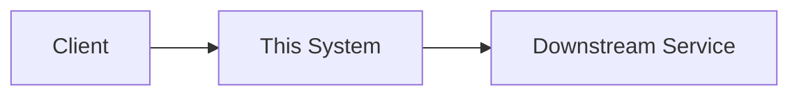

# <タイトル: 何を設計するドキュメントか>

- **Status**: Draft <!-- Draft / In Review / Approved / Implemented -->
- **Author(s)**:
- **Last Updated**: <!-- YYYY-MM-DD -->
- **Reviewers**:

## Context and Scope（背景と対象範囲）

<!--
このドキュメントを読む人が状況を理解するための、客観的な背景事実のみを簡潔に書く。
要件定義書ではないので、詳細な仕様は書かない。前提知識は読者にある程度期待してよく、
詳細情報は別ドキュメントへのリンクに留める。
-->

## Goals and Non-Goals（ゴールと非ゴール）

### Goals
-

### Non-Goals
<!--
非ゴールは「やらないこと」ではなく「ゴールになり得るがあえて選ばなかったこと」。
例: 「グローバル分散への対応」は非ゴールかもしれないが、それを明記することで
読者は「対応していない」ことを前提に設計を評価できる。
-->
-

## Design（設計）

### Overview

<!-- 全体像を1〜2段落で。詳細はこの後のサブセクションで。 -->

### System Context Diagram
<!-- 必要であれば、このシステムが全体のどこに位置するかを図示する（Mermaid可）。 -->

### API（該当する場合）
<!--
公開/内部APIがあれば概要レベルで記述する。正式なインターフェース定義や
スキーマをそのまま貼り付けるのは避ける（すぐ陳腐化し、冗長になるため）。
設計判断に関わる部分だけに絞る。
-->

### データストレージ（該当する場合）
<!-- どんなデータを、どういう形（テーブル/カラム/インデックス等）で持つか、概要レベルで。 -->

### 制約条件の度合い
<!--
グリーンフィールド（ゴールだけが決まっていて自由に設計できる）か、
既存システムの強い制約下での設計か。後者の場合、その制約を具体的に書く。
-->

## Alternatives Considered（検討した代替案）

<!--
最も重要なセクションの一つ。採用しなかった設計と、それぞれのトレードオフを書く。
「なぜ選ばれた設計が最善なのか」を、他の選択肢との比較で説明する。
-->

### Alternative 1: <名前>
- 概要:
- トレードオフ・不採用の理由:

### Alternative 2: <名前>
- 概要:
- トレードオフ・不採用の理由:

## Cross-Cutting Concerns（横断的関心事）

### セキュリティ

### プライバシー

### 可観測性（Metrics / Logs / Traces）

<!-- チームで標準化している横断的関心事があれば追加する（例: コスト、運用性など） -->

## Open Questions（未解決の論点）
<!-- まだ決まっていない、要検討の項目を正直に列挙する -->
-

## Appendix
<!-- プロトタイプへのリンク、参考資料など -->
