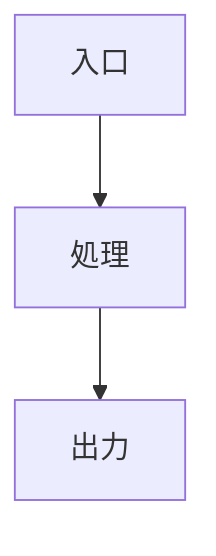
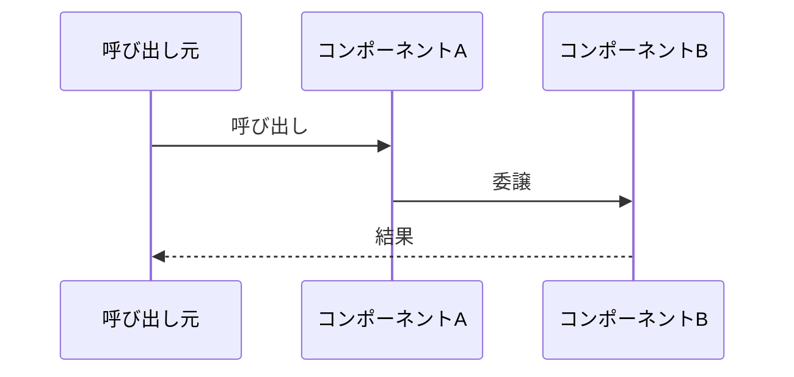

# tech-study-notes 📘

Investigate a technical topic (a library, a framework, a specific codebase, or a language mechanism) and turn it into a **beginner-friendly study note written in Japanese**. This is not a plain summary: the core purpose is to make clear **where the program starts (entry point)**, **what makes it start running (trigger)**, and **how it proceeds all the way to actually working**, always backed by code pointers and trustworthy sources.

## Language policy 🌐

- **Write this SKILL.md in English** (it already is).
- **Converse with the user in Japanese.** All chat-facing messages — clarifying questions, progress updates, the final hand-off — are in Japanese.
- **Write the generated `.md` note entirely in Japanese**, including headings, body, tags, and figure labels.

## When to use

Trigger on inputs such as:

- Understanding a mechanism: e.g. "how does gradle's `build.gradle.kts` work", "the internals of Go's `fmt` library"
- A specific class/module in a repository: e.g. "read through `BudgetControlService` in this repo"
- Grasping an architecture or processing flow: e.g. "lay out the overall structure of X"

## Output location & file naming 📂

- Location: `.repo-notes/study/` directly under the repository root (create it if it does not exist).
- Format: `.md`
- Naming rule: `<creation-date:yyyymmdd>_<short summary of the investigation>.md`
  - e.g. `20260711_goのfmtライブラリについて.md`
  - e.g. `20260717_gradleのbuild.gradle.ktsについて.md`
- Use the actual execution date for the date (use today's date; do not guess it). Write the summary portion in Japanese, concisely.

## How to investigate 🔍

Never write from assumption — always consult primary sources. The rough order:

1. **Pin down the target.** State in one sentence what the user wants to understand. If ambiguous, confirm the scope (just this class vs. the whole system, etc.).
2. **Gather primary sources.**
   - For a codebase, actually read the files. Use `grep` / file exploration to trace the entry point and call relationships.
   - For a library/framework, treat the **official documentation and official repository** as the source of truth (personal blogs and secondary sources are supplementary only). Use web search to confirm versions or the latest spec when needed.
3. **Identify the entry point and trigger.** Finding "where the program starts" and "what timing makes it start running" is the top priority — this is the backbone of the note.
4. **Reconstruct the runtime process.** Get to a state where you can explain, step by step, from startup to actually working.
5. **Write the note** following the template below.

## Writing conventions for the note ✍️

- **Language: Japanese** for the entire note.
- **Beginner-friendly:** add short glosses to jargon; support hard concepts with analogies or familiar examples.
- **Visual with emojis:** use emojis moderately on headings and key points for readability (🎯 goal / 🚪 entry / ⚡ trigger / 🔄 flow / 🧩 parts / 💡 point / 📚 sources, etc.). Not so many that it becomes noisy.
- **Explain with diagrams:** don't rely on prose alone for structure or flow — visualize with **Mermaid** diagrams and directory trees (e.g. a `tree` listing inside a ```` ```bash ```` block).
  - Overall structure → `graph TD` / `flowchart`
  - Time order / call sequence → `sequenceDiagram`
  - State transitions → `stateDiagram-v2`
- **Code pointers are mandatory:** for every explained location, attach the source reference as `path:line` (e.g. `src/main/Server.java:42`). For a library, cite the file/function name in the official repository.
- **Sources are mandatory:** cite trustworthy references such as official docs that back the explanation. Include URLs when available.
- **Comprehension tags:** record the key terms for understanding the topic as tags (in both the frontmatter and inside the note), so it is easy to search and cross-reference later.

## Note template 📝

Use the structure below. Sections that don't fit a given topic may be dropped or added, but **Entry point / Trigger / Runtime process / References are required**. Write everything inside the note in Japanese.

```markdown
---
title: <タイトル>
date: <yyyymmdd>
tags: [#タグ1, #タグ2, #タグ3]
---

# 📘 <タイトル>

## 🎯 これは何？（ざっくり一言）
<この技術/コードが何をするものか、初心者向けに1〜3文で>

## 🗺️ 全体像
<Mermaid の graph などで構造を図示。登場人物（コンポーネント）の関係を先に見せる>



## 🚪 エントリーポイント（どこから始まる？）
- 📍 場所: `path/to/entry.ext:行番号`
- <ここが起点である理由を説明。main関数・初期化処理・登録される場所など>

## ⚡ トリガー（いつ・何をきっかけに動く？）
- <起動条件を列挙。例: 「HTTPリクエスト受信時」「アプリ起動時のDIコンテナ初期化時」「cronで毎時0分」など>
- 📍 該当箇所: `path/to/file.ext:行番号`

## 🔄 動作プロセス（起動 → 実際に動くまで）
<起点から実際に動作するまでを順を追って解説。時系列は sequenceDiagram で補強>



1. **ステップ1**: <説明> — `path:行番号`
2. **ステップ2**: <説明> — `path:行番号`
3. ...

## 🧩 主要コンポーネント
| 名前 | 役割 | 場所 |
|------|------|------|
| <クラス/関数名> | <一言で> | `path:行番号` |

## 💡 理解のポイント
- 🔑 <このトピックを理解する鍵になる考え方・落とし穴・タグ的キーワード>
- ...

## 📚 参考文献
- [公式ドキュメント: <タイトル>](URL)
- <公式リポジトリの該当ファイル等>
```

## Worked example (for illustration)

**Input:** "I want to understand how Go's `fmt.Println` works."

**Output file:** `.repo-notes/study/20260711_goのfmtライブラリについて.md`

**Skeleton of the contents (written in Japanese):**
- 🎯 `fmt` is Go's standard library for formatted I/O; `Println` formats its arguments and writes them to standard output.
- 🚪 Entry point: show the definition of `Println` (the relevant function in `fmt/print.go`) and point out via a code pointer that it delegates to `Fprintln(os.Stdout, ...)`.
- ⚡ Trigger: the moment user code calls `fmt.Println(...)`.
- 🔄 Runtime process: argument formatting → write to `os.Stdout` (an `io.Writer`) → down to the syscall, illustrated with a `sequenceDiagram`, each stage backed by a pointer to the relevant location.
- 📚 References: the `fmt` docs on pkg.go.dev and `src/fmt/print.go` in the `golang/go` repository.

## Wrap-up

After writing the note, **always tell the user the path of the created file** (in Japanese). No long epilogue is needed — the file speaks for itself — so state the save location and title concisely.
